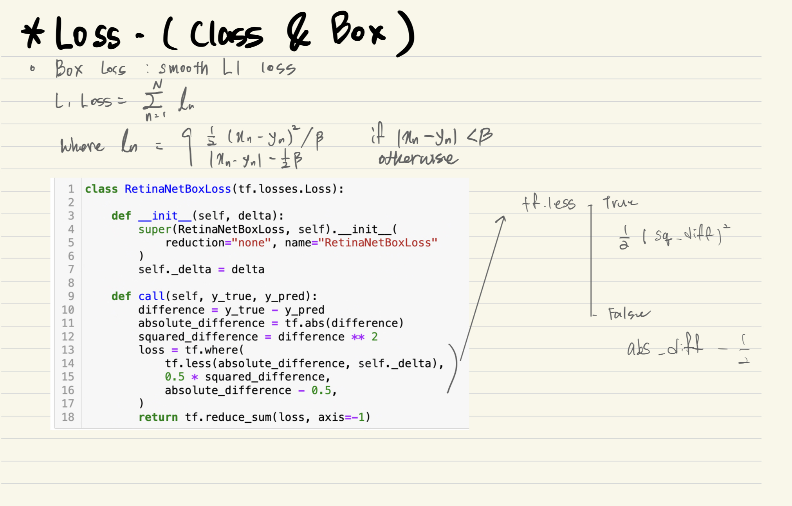

# AIFFEL Campus Online Code Peer Review
- 코더 : Hojae Jeong
- 리뷰어 : Minku Kim

# PR(Peer Review)
- [x]  **1. 주어진 문제를 해결하는 완성된 코드가 제출되었나요?**
    >루브릭 기준에 맞게 프로젝트를 잘 진행했습니다.
    
    | 평가문항                                                                                | 상세기준                                                                                  | 달성여부 |
    | --------------------------------------------------------------------------------------- | ----------------------------------------------------------------------------------------- | -------- |
    | 1. KITTI 데이터셋에 대한 분석이 체계적으로 진행되었다.                                  | KITTI 데이터셋 구조와 내용을 파악하고 이를 토대로 필요한 데이터셋 가공을 정상 진행하였다. | O        |
    | 2. RetinaNet 학습이 정상적으로 진행되어 object detection 결과의 시각화까지 진행되었다.  | 바운딩박스가 정확히 표시된 시각화된 이미지를 생성하였다.                                  |  O        |
    | 3. 자율주행 Object Detection 테스트시스템 적용결과 만족스러운 정확도 성능을 달성하였다. | 테스트 수행결과 90% 이상의 정확도를 보였다.                                               |  O        |


- [x]  **2. 전체 코드에서 가장 핵심적이거나 가장 복잡하고 이해하기 어려운 부분에 작성된 주석 또는 doc string을 보고 해당 코드가 잘 이해되었나요?**
    >이해가 어려운 코드에 주석을 잘 추가했습니다.   
    
    - 예시 코드 
    ```python
    def compute_iou(boxes1, boxes2):
    ## 중심좌표, W, H으로 변환
    boxes1_corners = convert_to_corners(boxes1)
    boxes2_corners = convert_to_corners(boxes2)
    
    # lu : left - up
    # rd : right - down
    # boxes1_corners : Anchor boxes
    # boxes2_corners : BBox
    lu = tf.maximum(boxes1_corners[:, None, :2], boxes2_corners[:, :2])
    rd = tf.minimum(boxes1_corners[:, None, 2:], boxes2_corners[:, 2:])
    
    #Get intersection_area
    intersection = tf.maximum(0.0, rd - lu)
    intersection_area = intersection[:, :, 0] * intersection[:, :, 1]
    
    #Get union_area
    boxes1_area = boxes1[:, 2] * boxes1[:, 3]
    boxes2_area = boxes2[:, 2] * boxes2[:, 3]
    union_area = tf.maximum(
        boxes1_area[:, None] + boxes2_area - intersection_area, 1e-8
    )
    return tf.clip_by_value(intersection_area / union_area, 0.0, 1.0)

    ```
     
- [x]  **3. 에러가 난 부분을 디버깅하여 문제를 “해결한 기록을 남겼거나” ”새로운 시도 또는 추가 실험을 수행”해봤나요?**
    >이번 프로젝트에서는 코드부분을 이해하는게 어려웠는데, 이에 대해 잘 분석했습니다.

  

- [ ]  **4. 회고를 잘 작성했나요?**
    - 주어진 문제를 해결하는 완성된 코드 내지 프로젝트 결과물에 대해 배운점과 아쉬운점, 느낀점 등이 기록되어 있는지 확인
    - 전체 코드 실행 플로우를 그래프로 그려서 이해를 돕고 있는지 확인


       
- [x]  **5. 코드가 간결하고 효율적인가요?**
    >전체적으로 코드가 굉장히 깔끔해서 보기 좋았습니다.

