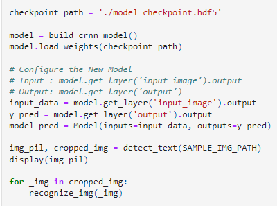
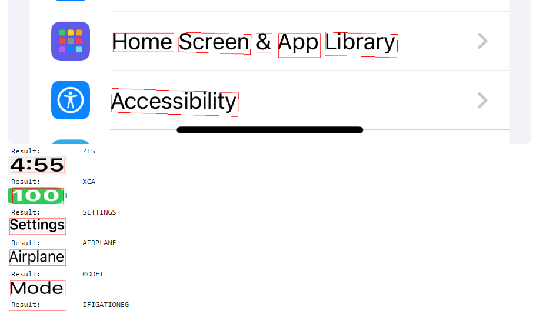
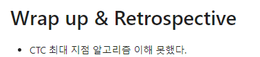

# AIFFEL Campus Online Code Peer Review
- 코더 : Hojae Jeong
- 리뷰어 : Minku Kim

# PR(Peer Review)
- [x]  **1. 주어진 문제를 해결하는 완성된 코드가 제출되었나요?**

    | 평가문항                                                                                                               | 상세기준                                                                                   | 달성여부 |
    | ---------------------------------------------------------------------------------------------------------------------- | ------------------------------------------------------------------------------------------ | -------- |
    | 1. Text recognition을 위해 특화된 데이터셋 구성이 체계적으로 진행되었다.                                               | 텍스트 이미지 리사이징, ctc loss 측정을 위한 라벨 인코딩, 배치처리 등이 적절히 수행되었다. |x         |
    | 2. CRNN 기반의 recognition 모델의 학습이 정상적으로 진행되었다.                                                        | 학습결과 loss가 안정적으로 감소하고 대부분의 문자인식 추론 결과가 정확하다.                |x          |
    | 3. keras-ocr detector와 CRNN recognizer를 엮어 원본 이미지 입력으로부터 text가 출력되는 OCR이 End-to-End로 구성되었다. | 샘플 이미지를 원본으로 받아 OCR 수행 결과를 리턴하는 1개의 함수가 만들어졌다.              | x         |
    >루브릭을 만족했습니다. 

    
- [x]  **2. 전체 코드에서 가장 핵심적이거나 가장 복잡하고 이해하기 어려운 부분에 작성된 
주석 또는 doc string을 보고 해당 코드가 잘 이해되었나요?**     
        
    >추론을 위해 모델을 재정의하는 부분인데, 어떤 부분을 input과 output으로 설정하는지 주석으로 표시해놔 이해하기 편합니다.
        
- [x]  **3. 에러가 난 부분을 디버깅하여 문제를 “해결한 기록을 남겼거나” 
”새로운 시도 또는 추가 실험을 수행”해봤나요?**    
    
    >본인 핸드폰의 스크린샷에 대해 모델 성능을 확인해본 부분이 재밌었습니다.    
          
- [x]  **4. 회고를 잘 작성했나요?**   
    
    >이해가 부족한 부분에 대해서 잘 기술되어 있습닏다.    

- [x]  **5. 코드가 간결하고 효율적인가요?**   
    >늘 느끼지만 코드가 참 깔끔해서 보기 좋습니다.
    

>오늘도 수고 많으셨습니다!

